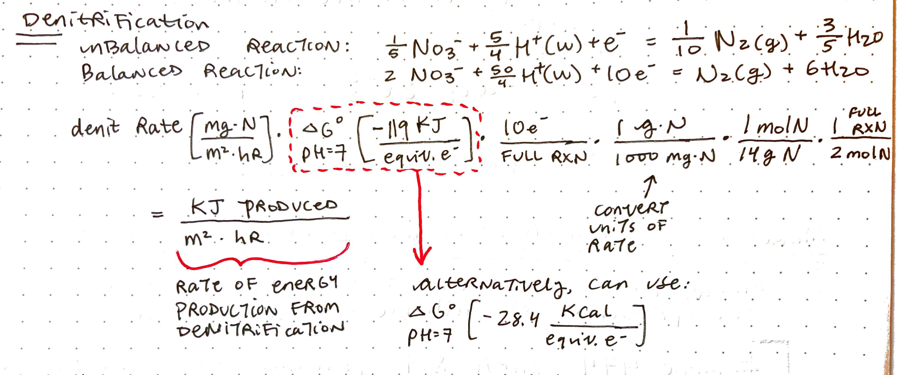
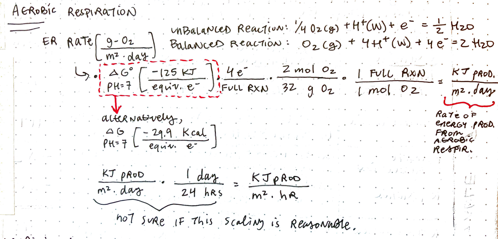

# Abstract

# Introduction

```{r setup, echo = FALSE, message = FALSE, warning = FALSE}
# Load libraries
library(tidyverse)
library(lubridate)
library(plotrix)
library(gridExtra)
library(ggmap)
library(ggrepel)
library(maps)
library(wesanderson)
library(corrplot)
library(svMisc)
library(ggfortify)
library(AppliedPredictiveModeling)
library(caret)
options(digits=3) # Change rounding to 3 digits
```

```{r load_CAREERsites, echo = FALSE, message = FALSE, warning = FALSE}
sites <- read.csv(file = "data/CAREER_SiteAttributes.csv")
```

```{r energyCalculation, echo = FALSE}
# Denitrification energy calculation
convertDenit <- function(denitData_mgNm2hr){
  denitData_mgNm2hr * 28.4 * 10 / 1000 / 14 / 2
}
# Ecosystem respiration energy calculation
convertER <- function(ERData_gO2m2d){
  ERData_gO2m2d * 29.9 * 4 * (2/32) / 24
}
```

```{r load_LINXII, echo = FALSE, message = FALSE, warning = FALSE}
# Site information and denitrification rates
LINXII <- 
  read_csv(file = "data/LINXII_Denit_Mulholland2009.csv", na = "NaN") %>% 
  filter(!is.na(DenitrificationRate_m))
LINXII_sites <- LINXII %>% select(State, SiteName, Source, LandUse, BIOME, 
                                  Latitude, Longitude, DrainageArea_ha)

# Convert denitrification rate per meter to v_fden 
# (see Mulholland 2009 methods)
LINXII$vfden_cms <- (LINXII$Discharge_Ls / LINXII$Width_m) *
  LINXII$DenitrificationRate_m * 0.1
# Convert v_fden to U_den in mg-N m-2 hr-1
## NOTE: MULHOLLAND ET AL 2009 SAYS to use 3.6 as the conversion factor -
## this is incorrect. The conversion factor should be 36 with these units
## This fix gives data that matches Figure 4 from Mulholland 2009 exactly
LINXII$Denit_mgNm2hr <- (LINXII$vfden_cms * LINXII$NO3_ugNL) * 36

# Metabolism
LINXII_met <- read_csv(file = "data/LINXII_Metab_Bernot2010.csv", na = "NaN")
# Merge
LINXII <- left_join(LINXII %>% select(-Latitude, -Longitude, -DrainageArea_ha,
                                      -vfden_cms),
          LINXII_met %>% select(-Latitude, -Longitude, -DrainageArea_ha))
# Remove
rm(LINXII_met)

# Run calculation
LINXII$EnergyDenit_kCalm2hr <- convertDenit(LINXII$Denit_mgNm2hr)
LINXII$EnergyER_kCalm2hr <- convertER(LINXII$ER_gO2m2d)
LINXII$EnergyTot_kCalm2hr <- LINXII$EnergyDenit_kCalm2hr + LINXII$EnergyER_kCalm2hr
LINXII$EnergyDenit_percent <- LINXII$EnergyDenit_kCalm2hr / LINXII$EnergyTot_kCalm2hr * 100
LINXII$EnergyER_percent <- LINXII$EnergyER_kCalm2hr / LINXII$EnergyTot_kCalm2hr * 100

# Create numeric dataset for modeling
LINXII_numeric <- LINXII %>% 
  select(-Source, -NOTES, -SiteName, -StudyDate_N15, -StudyDate_Metab) %>%
  mutate_if(is.character, as.factor)
# Dummy variables
dummies <- dummyVars( ~., data = LINXII_numeric)
LINXII_numeric <- data.frame(predict(dummies, newdata = LINXII_numeric))
# Add back in locations
LINXII_numeric$Latitude <- LINXII_sites$Latitude
LINXII_numeric$Longitude <- LINXII_sites$Longitude
LINXII_numeric <- LINXII_numeric %>% na.omit()
# Remove near zero variance columns
nzv <- nearZeroVar(LINXII_numeric)
LINXII_numeric <- LINXII_numeric[, -nzv]
```

```{r load_StreamPULSEmodels, echo = FALSE, message = FALSE, warning = FALSE}
# Create list of file names using site ID information
fileRegEx <- unique(paste0("predictions_",
                          sites$StreamPULSE_SiteID,".*rds"))
# Pull paths of matching file names
fileList <- lapply(fileRegEx, 
                   function(x){list.files(path = "data/all_sp_model_objects",
                                          pattern = x, full.names = T)})
fileList <- unlist(fileList)
# Load model results from files
modelResults <- sapply(fileList, readRDS, simplify = F, USE.NAMES = T)

# Create dummy function to calculate standard error
se <- function(x){
  sd(x, na.rm = T)/sqrt(length(na.omit(x)))
}

# Flatten list
modelResults <- bind_rows(modelResults, .id = "site")

# Format daily data
modelResults_all <- 
  modelResults %>%
  mutate(site = str_match(site, "predictions_(\\w{2}_\\w+)_")[,2],
         NEP = GPP - abs(ER),
         DOY = yday(date),
         year = as.factor(year(date)))

# Compute averages by month
modelResults_monthly <-
  modelResults %>%
  mutate(month = month(ymd(date), label = TRUE),
         site = str_match(site, "predictions_(\\w{2}_\\w+)_")[,2]) %>%
  group_by(site, month) %>%
  summarise(GPP_sd = sd(GPP, na.rm = T), 
            GPP_mean = mean(GPP, na.rm = T),
            ER_sd = sd(ER, na.rm = T),
            ER_mean = mean(ER, na.rm = T),
            # Calculate NEP as GPP - ER
            NEP_mean = mean(GPP - abs(ER), na.rm = T),
            NEP_sd = sd(GPP - abs(ER), na.rm = T))

# Compute averages by DOY
modelResults_DOY <-
  modelResults %>%
  mutate(DOY = yday(date),
         site = str_match(site, "predictions_(\\w{2}_\\w+)_")[,2]) %>%
  group_by(site, DOY) %>%
  summarise(GPP_sd = sd(GPP, na.rm = T), 
            GPP_mean = mean(GPP, na.rm = T),
            ER_sd = sd(ER, na.rm = T),
            ER_mean = mean(ER, na.rm = T),
            NEP_mean = mean(GPP - abs(ER), na.rm = T),
            NEP_sd = sd(GPP - abs(ER), na.rm = T))

############## Load and clean StreamPULSE nutrient data ############## 
```

```{r load_CAREERdata, echo = FALSE, message = FALSE, warning = FALSE}
############## Load nutrient process rates data ############## 
Nprocess <- read_csv(file = "data/CAREER_RatesTable.csv")
# Unite site code row with Nprocess table
#Nprocess <- left_join(Nprocess, sites[c(1,4)], by = "SiteName") # This isn't being matched correctly
Nprocess$date <- mdy(Nprocess$date)

# Unite with metabolism data
Nprocess <- 
  left_join(Nprocess, modelResults_all, 
            by = c("date", "StreamPULSE_SiteID" = "site")) 

# Filter to fixation and unamended denit
Nprocess <- 
  Nprocess %>%
  #filter(Process == "NFixation" | Process == "UnamendedDenit") %>%
  drop_na(StreamPULSE_SiteID) %>%
  #filter(Substrate %in% c("Sediment", "Rock", "Wood")) %>%
  select(-AFDM, -Chla, -SubstrateArea, -SubstrateVolume, -msgs.fit, -warnings, 
         -errors, -DOY, -year)
# Set Process names
Nprocess$Process <- factor(Nprocess$Process, 
         levels = c("N fixation", "UnamendedDenit", "Amended"),
         labels = c("Nitrogen Fixation", "Unamended Denitrification", 
                    "Amended Denitrification"))
```

```{r model_StreamPULSE, eval = FALSE}
# 18 Feb 2020
# This chunk is for modeling metabolism for sites with model records not yet
# compiled on StreamPULSE

# Load libraries
library(StreamPULSE)
library(streamMetabolizer)

# Choose model type and framework
model_type <- "bayes"
model_name <- "streamMetabolizer"

# Request variables
vars <- c('DO_mgL','DOsat_pct','satDO_mgL','WaterPres_kPa',
          'Depth_m','WaterTemp_C','Light_PAR','AirPres_kPa',
          'Discharge_m3s', "ChlorophyllA_ugL", "Nitrate_mgL")

## See if you can pull in NEON discharge data with NEON utilities package
# Data to be pulled from NEON:
# Depth_m, WaterTemp_C, Nitrate_mgL, ChlorophyllA_ugL, DO_mgL, DOsat_pct, satDO_mgL, WaterPres_kPa, Light_PAR, AirPres_kPa, Discharge_m3s 

# Streampulse variable    NEON product ID     NEON name
# Depth_m                 DP1.20016.001       Elevation of surface water
# WaterTemp_C             DP1.20053.001       Temperature (PRT) in surface water
# DO_mgL                  DP1.20288.001       Water quality
# DOsat_pct
# satDO_mgL
# WaterPres_kPa
# Light_PAR               DP1.00024.001       Photosynthetically active radiation (PAR)
# AirPres_kPa
# Discharge_m3s
# Nitrate_mgL
# ChlorophyllA_ugL      DP1.20288.001       Water quality

# Ahh. NEON collects field-based surveys of discharge, intermittant

# Define list of sites for metabolism modeling
siteList <- c("NH_HBF", "NH_WHB", "MA_HOPB-down", "PR_GUIL-up")

# This loop will iterate through the list of sites, pulling data from 
# StreamPULSE and modeling metabolism for the period of record. Metabolism 
# models for each site will be saved to RData files within /model_outputs/
for (i in 1:length(siteList)){
  # Define site
  site <- siteList[i]
  print(site)
  flush.console()
  # Start timer for run
  startTime <- proc.time()
  
  ######################## Pull data from StreamPULSE ########################
  data <- request_data(sitecode = site, variables = vars)
  # If error in pulling data, throw warning and move on to next site in list
  if (!exists("data")){
    warning(paste0("Data could not be pulled for site ", site))
    flush.console()
    next
  }
  # Display success message
  message(paste0("Data pulled for site ", site, ". \nElapsed time: ", 
                 (proc.time()[3]-startTime[3])/60, " minutes"))
  flush.console()
  
  ######################## Format data for modeling ########################
  data_prep <- prep_metabolism(d = data, type = model_type, model = model_name,
                               rm_flagged = list("Bad Data", "Questionable"),
                               interval = "15 min",
                               estimate_areal_depth = TRUE,
                               retrieve_air_pres = TRUE)
  # Display success message
  message(paste0("Data formatted for site ", site, ". \nElapsed time: ", 
                 (proc.time()[3]-startTime[3])/60, " minutes"))
  flush.console()
  
  ############################ Model metabolism ############################
  # If no discharge data, set poolK_600='none'
  if (grepl("Discharge_m3s", data_prep$specs$missing_variables)){
    message(paste0("Discharge data missing for site ", site, 
                   ". Will use fit_metabolism with poolK_600='none'."))
    flush.console()
    model_fit <- fit_metabolism(data_prep, pool_K600 = "none")
  } else {
    # Otherwise, execute as normal
    model_fit <- fit_metabolism(data_prep)
  }
  # Display success message
  message(paste0("Metabolism modeled for site ", site, ". \nElapsed time: ", 
                 (proc.time()[3]-startTime[3])/60, " minutes"))
  flush.console()
  
  ############################ Save to file ############################
  saveRDS(model_fit, file = paste0("./model_outputs/Metabolism_", site, ".RData"))
  message(paste0("Model for site ", site, " saved to file. \nElapsed time: ", 
                 (proc.time()[3]-startTime[3])/60, " minutes"))
  flush.console()
}

# QAQC notes: run UT_REDB-up for a small length of time, lots of NA depth, 
# estimates from full TS are negative

ggplot(data = model_fit$predictions) +
  geom_point(aes(x = date, y = ER)) +
  geom_ribbon(aes(ymin = ER.lower, ymax = ER.upper, x = date))
```

```{r pull-NEON, eval = FALSE}
# Load libraries --------------------------------------------------------------
library(neonUtilities) # Built under R version 3.6.2
# Since neonUtilities is an old build, we need to tell R to ignore warnings
# thrown when downloading the NEON-water-quality localPressureDO package, 
# otherwise the install will fail
#Sys.setenv(R_REMOTES_NO_ERRORS_FROM_WARNINGS = "true")
#devtools::install_github(repo = "NEONScience/NEON-water-quality/localPressureDO")
library(localPressureDO)
library(streamMetabolizer)

## Pull raw NEON dataset -----------------------------------------------------
# Define sites of interest
NEONsites <- c("ARIK")
#NEONsites <- c("ARIK", "REDB", "PRIN", "MCDI", "KING", "HOPB", "GUIL", "CUPE", 
#               "SYCA", "CARI", "BLDE", "MCRA", "MART")

# Define parameters of interest
params <- c("DP1.20288.001", "DP1.20053.001", #"DP1.20267.001", 
            "DP1.20033.001")
names(params) <- c("WaterQual", "Temp", #"GaugeHt", 
                   "NO3")

# Define start and end dates
startdate <- "2019-01"
enddate <- "2019-12"

# Pull data from NEON
for (i in seq_along(params)){
  # Set dpID to i-th parameter
  dpID <- params[i]
  
  # Pull NEON data for parameter, saving the data to the variable name from
  # names(params)
  assign(names(dpID), 
         value = loadByProduct(dpID = dpID, site = NEONsites, 
                               startdate = startdate, enddate = enddate, 
                               package = "basic"))
}

## Correct dissolved oxygen percent saturation -------------------------------
# Pull DO-related products for sites of interest
DOdata <- getAndFormatData(siteName = NEONsites, startDate = startdate, 
                           endDate = enddate)
# Calculate DO percent saturation at local using the Benson-Krause equation,
# Which is the same method as used by the USGS since 2011
DOcalcd <- calcBK_eq(DOdata)
# Trim DOcalcd dataset
DOcalcd <- 
  DOcalcd %>%
  select(horizontalPosition, startDateTime, siteID, 
         dissolvedOxygenSatCorrected)
# Remove DO percent saturation from WaterQual
# Merge corrected DO percent saturation with WaterQual dataset
WaterQual$waq_instantaneous <- 
  right_join(WaterQual$waq_instantaneous, DOcalcd, 
             by = c("siteID", "startDateTime", "horizontalPosition"))

# Save raw NEON datafiles, with corrected DO sat, to external harddrive -------
#saveRDS(WaterQual, 
#        file = "/Volumes/Ext001_MCK/Datasets/CAREER_NEON/WaterQual.RData")
#saveRDS(Temp, file = "/Volumes/Ext001_MCK/Datasets/CAREER_NEON/Temp.RData")
#saveRDS(NO3, file = "/Volumes/Ext001_MCK/Datasets/CAREER_NEON/NO3.RData")

# Load raw NEON datafiles from external harddrive
#WaterQual <- 
#  readRDS(file = "/Volumes/Ext001_MCK/Datasets/CAREER_NEON/WaterQual.RData")
#Temp <- readRDS(file = "/Volumes/Ext001_MCK/Datasets/CAREER_NEON/Temp.RData")
#NO3 <- readRDS(file = "/Volumes/Ext001_MCK/Datasets/CAREER_NEON/NO3.RData")

# Create metadata tibble for site information
# May be unneeded - consult the CAREER site list metadata file
WQ_meta <- 
  WaterQual$sensor_positions_20288 %>%
  select(siteID, referenceDescription, referenceStart, referenceEnd,
         referenceLatitude, referenceLongitude, referenceElevation) %>%
  # Filter to active stations
  filter(referenceEnd == "")
# Add horizontal position column
WQ_meta$horizontalPosition <- c("S1", "S2", "S2")

# S1 = upstream, S2 = downstream
WQ_data <- 
  WaterQual$waq_instantaneous %>%
  select(siteID, horizontalPosition, startDateTime, specificConductance, 
         dissolvedOxygen, dissolvedOxygenSatCorrected, pH, chlorophyll, 
         turbidity) %>%
  mutate(horizontalPosition = recode(horizontalPosition, "101" = "S1", 
                                     "102" = "S2"))
# Add longitude to WQ_data for use in solartime conversion
WQ_data <- 
  right_join(WQ_data, WQ_meta %>% select(horizontalPosition, referenceLongitude), 
             by = "horizontalPosition")

# Convert datetime to chron solartime -----------------------------------------
# Convert to UTC timezone
WQ_data$startDateTime <- with_tz(WQ_data$startDateTime, tz = "UTC")
# Convert from UTC to solar time using streamMetabolizer
WQ_data$solarTime <- 
  convert_UTC_to_solartime(WQ_data$startDateTime, 
                           longitude = WQ_data$referenceLongitude)

# Save trimmed WQ_data to local folder ----------------------------------------
saveRDS(WQ_data, file = "./data/NEON_formatted/NEON_WaterQual.RData")
saveRDS(WQ_meta, file = "./data/NEON_formatted/NEON_WaterQualMeta.RData")

# Stack to format for 2-station metabolism, then save formatted stacked file
l

```

```{r NEON-reaeration, eval=FALSE}
# Load libraries --------------------------------------------------------------
#library(neonUtilities) # Built under R version 3.6.2
# Since neonUtilities is an old build, we need to tell R to ignore warnings
# thrown when downloading the NEON-water-quality localPressureDO package, 
# otherwise the install will fail
#Sys.setenv(R_REMOTES_NO_ERRORS_FROM_WARNINGS = "true")
#devtools::install_github(repo = "NEONScience/NEON-reaeration/reaRate")
library(reaRate)

# Download NEON reaeration data product
rea_data <- def.format.reaeration(site = NEONsites)
```

```{r plotNEPmonthlymean, eval = F, fig.cap="Time series data of daily NEP (grey lines) and calculated mean NEP for each day of year (colored lines, A), and calculated mean monthly NEP (B) for the period of record. Shaded ribbons (B) represent standard deviation of NEP.", echo = FALSE, message = FALSE, warning = FALSE, fig.height=5.5, fig.width = 8, fig.pos="center"}
# Plot of DOY vs GPP or ER, faceted by site
a <- 
  ggplot(data = NULL) +
  # Facet wrap plots
  facet_wrap(~site, nrow = 3) +
  # Lines for all years of data
  geom_line(data = modelResults_all, aes(x = DOY, y = NEP, linetype = year), color = "darkgrey", alpha = 0.7) +
  # Lines for mean data
  geom_line(data = modelResults_DOY, aes(x = DOY, y = NEP_mean, color = site)) +
  geom_hline(yintercept = 0, linetype = 2) +
  # Axis labels and scales
  ylab(expression("NEP (g"~O[2]~m^2~"d"^{-1}*")")) +
  xlab("Day of year") +
  labs(tag = "A") +
  # Remove legend for site
  guides(color = FALSE, linetype = guide_legend(nrow = 3, title = "Year")) +
  # Theme adjustments
  theme_classic() +
  theme(axis.text = element_text(color = "black"), 
        panel.background = element_rect(color = "black"),
        legend.position = "bottom") +
  # Color scales
  scale_color_brewer(palette = 2, type = "qual")

# Plot of average NEP by month, all sites on one plot
b <- 
  ggplot(data = modelResults_monthly, aes(x = month, group = site)) +
  # Ribbon for visualizing standard error
  geom_ribbon(aes(ymin = NEP_mean-NEP_sd, 
                  ymax = NEP_mean+NEP_sd, fill = site), alpha = 0.1)+
  # Line and points for mean NEP
  geom_line(aes(y = NEP_mean, color = site)) +
  geom_point(aes(y = NEP_mean, color = site), 
             shape = 21, fill = "white", size = 2) +
  # Horizontal line at y = 0
  geom_hline(yintercept = 0, linetype = 2) +
  # Axis labels and scales
  labs(tag = "B", fill = "Site", color = "Site") +
  ylab(expression("NEP (g"~O[2]~m^2~"d"^{-1}*")")) +
  xlab("Day of year") +
  # Theme adjustments
  guides(color = guide_legend(nrow = 3), fill = guide_legend(nrow = 3))+
  theme_classic() +
  theme(axis.text = element_text(color = "black"), 
        panel.background = element_rect(color = "black"), 
        legend.position = "bottom") +
  # Color scales
  scale_color_brewer(palette = 2, type = "qual") +
  scale_fill_brewer(palette = 2, type = "qual")

grid.arrange(a,b, ncol = 2)
```

```{r plotNEPloess, eval = F, fig.cap="Time series data of daily NEP (grey lines) and calculated mean NEP for each day of year (colored lines, A), and annual trends in NEP over the period of record visualized using local polynomial regression fitting (LOESS, B). Shaded ribbons (B) represent 95% confidence interval on LOESS estimate.", echo = FALSE, message = FALSE, warning = FALSE, fig.height=5.5, fig.width = 8, fig.pos="center"}
# Plot of DOY vs GPP or ER, faceted by site
c <- 
  ggplot(data = NULL) +
  # Facet wrap plots
  facet_wrap(~site, nrow = 3) +
  # Lines for all years of data
  geom_line(data = modelResults_all, aes(x = DOY, y = NEP, linetype = year), color = "darkgrey", alpha = 0.7) +
  # Lines for mean data
  geom_line(data = modelResults_DOY, aes(x = DOY, y = NEP_mean, color = site)) +
  
  geom_hline(yintercept = 0, linetype = 2) +
  # Axis labels and scales
  ylab(expression("NEP (g"~O[2]~m^2~"d"^{-1}*")")) +
  xlab("Day of year") +
  labs(tag = "A") +
  # Remove legend for site
  guides(color = FALSE, linetype = guide_legend(nrow = 3, title = "Year")) +
  # Theme adjustments
  theme_classic() +
  theme(axis.text = element_text(color = "black"), 
        panel.background = element_rect(color = "black"),
        legend.position = "bottom") +
  # Color scales
  scale_color_brewer(palette = 2, type = "qual")

# LOESS smooth
d <- 
  ggplot(data = modelResults_all, aes(x = DOY, y = NEP)) +
  stat_smooth(aes(color = site, fill = site), method = "loess") +
  # Horizontal line at y = 0
  geom_hline(yintercept = 0, linetype = 2) +
  # Axis labels and scales
  labs(tag = "B", fill = "Site", color = "Site") +
  ylab(expression("NEP (g"~O[2]~m^2~"d"^{-1}*")")) +
  xlab("Month") +
  # Theme adjustments
  guides(color = guide_legend(nrow = 3), fill = guide_legend(nrow = 3))+
  theme_classic() +
  theme(axis.text = element_text(color = "black"), 
        panel.background = element_rect(color = "black"), 
        legend.position = "bottom") +
  # Color scales
  scale_color_brewer(palette = 2, type = "qual") +
  scale_fill_brewer(palette = 2, type = "qual")

grid.arrange(c,d, ncol = 2)


# Compute PCA of metabolism data
#prcomp(modelResults_all[,c(3,6,12,13)], center = T, scale. = T)


#modelResults_all %>%
 # select(GPP, ER, NEP, DOY)

# Compute Kmediods using pam (Partitioning Around Medoids) from cluster
#collsub_kmediods <- pam(colleges_sub, k = 3)
# For K-mediods results
#fviz_cluster(collsub_kmediods, data = colleges_sub) + 
 # labs(tag = "B", title = "K-mediods clustering") +
#  theme_classic() +
#  theme(legend.position = "none")
```

```{r plotNProcessRates, eval = F, fig.cap="Nitrogen fixation and denitrification rates measured on the dominant substrate (macrophyte, rock, sediment, or wood; where rock includes rock flock, rock cobble, rock scrape, bedrock scrape, pebble, and bedrock; sediment includes clay) at each study site. Vertical black lines extend from the first quartile minus 1.5 times the interquartile range to the third quartile plus 1.5 times the interquartile range. Note that y-axis is on a log scale.", echo = FALSE, message = FALSE, warning = FALSE, fig.height=5, fig.width = 10, fig.pos="center"}
Nprocess_plot <- Nprocess
  # Group rock cobble and rock flock into rock category
Nprocess_plot$Substrate <- recode(Nprocess_plot$Substrate, "Rock Flock" = "Rock", 
                             "Rock Cobble" = "Rock", "Rock scrape" = "Rock",
                             "Bedrock scrape" = "Rock", "Pebble" = "Rock",
                             "Bedrock" = "Rock",
                             "Clay" = "Sediment")

ggplot(data = Nprocess_plot, aes(x = SiteName, y = ProcessRate)) +
  stat_boxplot(geom = "errorbar", width = 0, height = 0) +
  geom_point(aes(fill = Substrate, shape = Substrate), size = 4) +
  #geom_stat() +
  # Facet wrap plots
  facet_wrap(~Process, ncol = 3) +
  # Axis labels and scales
  ylab(expression("Rate (ug-N"~m^2~"hr"^{-1}*")")) +
  xlab("Site") +
  # Theme adjustments
  scale_y_log10(labels = scales::comma) +
  #scale_y_continuous(limits = c(0, NA)) +
  theme_classic() +
  theme(axis.text = element_text(color = "black"), 
        axis.text.x = element_text(angle = 45, hjust = 1, vjust = 1),
        panel.background = element_rect(color = "black"), 
        legend.position = "bottom") +
  # Color scales
  scale_shape_manual(values = c(21, 24, 22, 23)) +
  scale_fill_brewer(palette = 2, type = "qual")
```

```{r plotNProcessRates-flip, eval = F, fig.cap="Nitrogen fixation and denitrification rates measured on the dominant substrate (macrophyte, rock, sediment, or wood; where rock includes rock flock, rock cobble, rock scrape, bedrock scrape, pebble, and bedrock; sediment includes clay) at each study site. Vertical black lines extend from the first quartile minus 1.5 times the interquartile range to the third quartile plus 1.5 times the interquartile range. Note that y-axis is on a log scale.", echo = FALSE, message = FALSE, warning = FALSE, fig.height=10, fig.width = 5, fig.pos="center"}
ggplot(data = Nprocess_plot, aes(x = SiteName, y = ProcessRate)) +
  stat_boxplot(geom = "errorbar", width = 0, height = 0) +
  geom_point(aes(fill = Substrate, shape = Substrate), size = 4) +
  #geom_stat() +
  # Facet wrap plots
  facet_wrap(~Process, ncol = 1) +
  # Axis labels and scales
  ylab(expression("Rate (ug-N"~m^2~"hr"^{-1}*")")) +
  xlab("Site") +
  # Theme adjustments
  scale_y_log10(labels = scales::comma) +
  #scale_y_continuous(limits = c(0, NA)) +
  theme_classic() +
  theme(axis.text = element_text(color = "black"), 
        #axis.text.x = element_text(angle = 45, hjust = 1, vjust = 1),
        panel.background = element_rect(color = "black"), 
        legend.position = "bottom") +
  # Color scales
  scale_shape_manual(values = c(21, 24, 22, 23)) +
  scale_fill_brewer(palette = 2, type = "qual") +
  coord_flip()
```

```{r correlations, fig.cap="Correlations between predictor variables, computed using Pearson correlation", echo = FALSE, message = FALSE, warning = FALSE, fig.height=5, fig.width = 5, fig.pos="center", eval = F}
# Subset only rates measured on sediment or rock, seperate into columns, 
# Get rid of non-numeric columns
corrmatrix <- 
  Nprocess %>%
  filter(ProcessRate > 0) %>% # Only use non-zero rates
  mutate(absvalER = abs(ER), ER = NULL) %>%
  select(-SE, -GPP.lower, -GPP.upper, -ER.lower, -ER.upper) %>%
  pivot_wider(names_from = Process, values_from = ProcessRate) %>%
  filter(Substrate %in% c("Sediment", "Rock", "Wood", "Macrophyte")) %>%
  #pivot_wider(names_from = Substrate, 
   #           values_from = c(UnamendedDenit, NFixation)) %>%
  # Filter out non-numeric columns
  select(-date, -SiteName, -StreamPULSE_SiteID, -Substrate)

# Plot correlation
corrplot(cor(corrmatrix, use = "pairwise.complete.obs"), #order = "hclust", 
         type = "upper", tl.col = "black", addgrid.col = F, outline = T, 
         addCoef.col = "white", tl.cex = 0.8)

# Test denitrificiation vs GPP, denit vs ER
cor.test(x = corrmatrix$`Unamended Denitrification`, y = corrmatrix$GPP)
cor.test(x = corrmatrix$`Unamended Denitrification`, y = corrmatrix$absvalER)
```

```{r NEPProcessRate, eval = FALSE, fig.cap="Nitrogen fixation and denitrification rates and net ecosystem production (NEP) on day of sampling at each study site.", echo = FALSE, message = FALSE, warning = FALSE, fig.height=5, fig.width = 8, fig.pos="center"}
# Faceted plot of N Fixation and Unamended Denitrification against NEP
ggplot(data = Nprocess_subst) +
  geom_point(aes(x = ProcessRate_UnamendedDenit_rock, y = abs(ER), color = "rock")) +
  geom_point(aes(x = ProcessRate_UnamendedDenit_sediment, y = abs(ER), color = "sediment")) 

ggplot(data = Nprocess_subst) +
  geom_point(aes(x = ProcessRate_UnamendedDenit_rock, y = NEP, color = "rock")) +
  geom_point(aes(x = ProcessRate_UnamendedDenit_sediment, y = NEP, color = "sediment")) +
  scale_x_continuous(limits = c(1, NA))

ggplot(data = Nprocess_subst) +
  geom_point(aes(x = ProcessRate_NFixation_rock, y = NEP, color = "rock")) +
  geom_point(aes(x = ProcessRate_NFixation_sediment, y = NEP, color = "sediment")) 
  scale_x_continuous(limits = c(1, NA))

ggplot(data = Nprocess) +
  geom_point(aes(y = GPP, x = ProcessRate, 
                 color = StreamPULSE_SiteID, #fill = site, 
                 shape = Substrate
                 ), size = 4) +
  # Horizontal line at y = 0
  geom_hline(yintercept = 0, linetype = 2) +
  # Facet wrap plots
  facet_wrap(~Process, nrow = 1, scales = "free_x") +
  scale_x_continuous(limits = c(0, NA))+
  # Theme adjustments
  ylab(expression("GPP (g"~O[2]~m^2~"d"^{-1}*")")) +
  xlab(expression("Rate (ug-N"~m^2~"hr"^{-1}*")")) +
  theme_classic() +
  theme(axis.text = element_text(color = "black"), 
        panel.background = element_rect(color = "black")) #+
  # Color scales
  #scale_color_brewer(palette = 2, type = "qual")
```

# Methods  

## Site description  

```{r plotMap, fig.cap="Map of StreamPULSE (n = 12) and NEON (n = 13) study sites used in this analysis. Blue = StreamPULSE site, orange = NEON site. (would be neat to have a way to show years of metabolism record for each site on this map)", echo = FALSE, message = FALSE, warning = FALSE, fig.pos="center", fig.height=6, fig.width = 10}
##### Plot CAREER Site Map #####
# Pull state map data
world.map <- map_data("world")
states.map <- map_data("state")

# Plot map
ggplot() +
  # State and country outlines
  geom_polygon(data = world.map, aes(x = long, y = lat, group = group), 
               color = "grey", size = 0.2, fill = NA) +
  geom_polygon(data = states.map, aes(x = long, y = lat, group = group), 
               color = "grey", size = 0.2, fill = NA) +
  geom_polygon(data = subset(world.map, region == "USA"), 
               aes(x = long, y = lat, group = group), 
               color = "black", size = 0.2, fill = NA) +
  # Location markers and labels
  geom_label_repel(data = sites, aes(x = Longitude, y = Latitude, 
                                     label = SiteName), 
                   box.padding = 1, size = 4, nudge_x = 0.01, 
                   segment.size = 0.5, segment.color = "black", 
                   label.size = 0.6) +
  geom_point(data = sites, aes(x = Longitude, y = Latitude, fill = Source), 
             shape = 21, 
             color = "black", size = 4, stroke = 1) +
  coord_fixed(1.3, xlim = c(-180,-30), ylim = c(10, 75)) +
  # Theme adjustments
  theme_nothing() +
  theme(panel.background = element_rect(color = "black", fill = "white")) +
  scale_fill_manual(values=wes_palette(n=4, name="FantasticFox1")) +
  guides(fill = FALSE)
```

```{r plotMapLINXII, fig.cap="Map of StreamPULSE (n = 12), NEON (n = 13), and LINXII (n = 49) study sites used in this analysis. Blue = StreamPULSE site, yellow = NEON site, orange = LINXII site.", echo = FALSE, message = FALSE, warning = FALSE, fig.pos="center", fig.height=6, fig.width = 10}
##### Plot LINXII and CAREER Site Map #####

# Merge sites_LINXII with sites
sites <- full_join(sites, LINXII_sites) %>% filter(Source != "Other")

# Pull state map data
world.map <- map_data("world")
states.map <- map_data("state")

# Plot map
ggplot() +
  # State and country outlines
  geom_polygon(data = world.map, aes(x = long, y = lat, group = group), 
               color = "grey", size = 0.2, fill = NA) +
  geom_polygon(data = states.map, aes(x = long, y = lat, group = group), 
               color = "grey", size = 0.2, fill = NA) +
  geom_polygon(data = subset(world.map, region == "USA"), 
               aes(x = long, y = lat, group = group), 
               color = "black", size = 0.2, fill = NA) +
  # Location markers
  geom_point(data = sites, aes(x = Longitude, y = Latitude, fill = Source), 
             shape = 21, size = 4, stroke = 0.5, color = "black") +
  coord_fixed(1.3, xlim = c(-160,-60), ylim = c(15, 70)) +
  # Theme adjustments
  theme_nothing() +
  theme(panel.background = element_rect(color = "black", fill = "white")) +
  #scale_fill_manual(values=wes_palette(n=3, name="FantasticFox1")) +
  guides(fill = FALSE)

# Plot map
#ggplot() +
  # State and country outlines
#  geom_polygon(data = world.map, aes(x = long, y = lat, group = group), 
#               color = "grey", size = 0.2, fill = NA) +
#  geom_polygon(data = states.map, aes(x = long, y = lat, group = group), 
#               color = "grey", size = 0.2, fill = NA) +
#  geom_polygon(data = subset(world.map, region == "USA"), 
#               aes(x = long, y = lat, group = group), 
#               color = "grey", size = 0.2, fill = NA) +
  # Location markers
  #geom_point(data = sites, aes(x = Longitude, y = Latitude, fill = Source), 
  #           shape = 21, size = 4, stroke = 0.5, color = "black") +
#  geom_point(data = LINXII_numeric, aes(x = Longitude, y = Latitude, 
#                                        fill = EnergyDenit_percent,
#                                        size = EnergyDenit_percent), 
#             shape = 21, stroke = 0.5, color = "black", position = "jitter") +
#  coord_fixed(1.3, xlim = c(-130,-60), ylim = c(15, 50)) +
#  scale_size_identity(aesthetics = "size") +
  # Theme adjustments
  #theme_nothing() +
#  theme(panel.background = element_rect(color = "black", fill = "white")) 
```

## Denitrification measurement

## Metabolism modeling

### Single-station

### Two-station

## LINX II dataset  

Denitrification rates (as $k_{den}$, $m^{-1}$) were obtained from Mulholland et al. [-@mulholland2009] appendix. Rates were then converted to areal denitirification rates using conversion steps outlined in the methods of Mulholland et al. [-@mulholland2009], where $k_{denT}$ = denitrification rate per unit time ($d^{-1}$), $v$ = average water velocity ($cm ~ s^{-1}$), $v_{fden}$ = denitrification uptake velocity ($cm ~ s^{-1}$), $Q$ = discharge ($L ~ s^{-1}$), $w$ = average stream wetted width ($m$),$U_{den}$ = areal denitirification rate ($mg ~ m^{-2} ~ hr^{-1}$), $C$ = ambient nitrate concentration (ug-N $L^{-1}$).

$$k_{denT} = k_{den} * v * 864$$

$$v_{fden} = (Q/w) * k_{den} * 0.1$$

$$U_{den} = (v_{fden} * C) * 36$$

Metabolism data (gross primary production, ecosystem respiration) for streams in the LINX II project was obtained from Bernot et al. [-@bernot2010] supplemental information.  

## Conversion from Process Rate to Energy Production  

Process rates (ex. denitrification in mg-N $m^{-2} ~ hr^{-1}$) were converted to energy production rates (kCal $m^{-2} ~ hr^{-1}$) using Gibbs free energy ($\Delta G$) values and molar conversion factors from the balanced chemical reactions of each process.

![Gibbs free energy ($\Delta G$) produced by selected reduction and oxidation reactions in natural waters [at pH = 7; see @stumm_aquatic_1996 pp. 474, 477].](images/Table8-7_Handwritten.jpeg)





# Results

```{r DenitRatevsPercentTotalNRG, fig.cap="LINX II streams with 'low' denitrification rate may still source a significant portion of their energy from denitrification, when total energy is considered as Gibbs free energy produced through denitrification plus Gibbs free energy produced through ecosystem respiration. Dashed line has a slope of 1, representing a denitrification rate proportional to the fraction of total energy released from denitrification.", fig.height=5, fig.width=5, fig.pos="H"}
ggplot(data = LINXII, aes(x = Denit_mgNm2hr, y = EnergyDenit_percent, 
                          fill = ER_gO2m2d)) +
  geom_abline(slope = 1, intercept = 0, linetype = 2) +
  # Label with site names
  #geom_text_repel(label = LINXII$SiteName, size = 3) + 
  # Add data points
  geom_point(size = 3, shape = 21) +
  # Theme adjustments
  theme_classic() +
  labs(x = expression("Denitrification rate (mg-N" ~ m^{-2} ~ hr^{-1} * ")"), 
       y = expression("Percentage of total energy released via denitrification (%)"),
       fill = expression("|ER| (g-"*O[2] ~ m^{-2} ~ d^{-1} * ")")) +
  theme(panel.border = element_rect(color = "black", fill = NA),
        axis.text = element_text(color = "black"),
        legend.position = c(0.2, 0.8),
        legend.background = element_rect(color = "black", fill = NA))

# Stats
#cor.test(x = LINXII$ER_gO2m2d, y = LINXII$EnergyDenit_percent, 
#         method = "pearson", use = "complete.obs")
```

```{r NO3vsPercentTotalNRG, eval = F, fig.cap="NO3- is an even better predictor of the percentage of total released energy via denitrification than it is of denitrification rate for LINXII streams.", fig.height=5, fig.pos="H"}
a <- 
  ggplot(data = LINXII, 
       aes(x = NO3_ugNL, y = EnergyDenit_percent)) +
  geom_smooth(method = "lm", color = "black") +
  ggpubr::stat_cor() +
  # Label with site names
  #geom_text_repel(label = LINXII$SiteName, size = 3) + 
  # Add data points
  geom_point(size = 3, shape = 21) +
  # Theme adjustments
  theme_classic() +
  labs(tag = "A",
       x = expression("NO3- (ug-N" ~ L^{-1} * ")"), 
       y = expression("Percentage of total energy released via denitrification (%)")) +
  theme(panel.border = element_rect(color = "black", fill = NA),
        axis.text = element_text(color = "black"))

b <- 
  ggplot(data = LINXII, 
       aes(x = NO3_ugNL, y = Denit_mgNm2hr)) +
  geom_smooth(method = "lm", color = "black") +
  ggpubr::stat_cor() +
  # Label with site names
  #geom_text_repel(label = LINXII$SiteName, size = 3) + 
  # Add data points
  geom_point(size = 3, shape = 21) +
  # Theme adjustments
  theme_classic() +
  labs(tag = "B",
       x = expression("NO3- (ug-N" ~ L^{-1} * ")"), 
       y = expression("Denitrification rate (mg-N" ~ m^{-2} ~ hr^{-1} * ")")) +
  theme(panel.border = element_rect(color = "black", fill = NA),
        axis.text = element_text(color = "black"))

grid.arrange(a, b, nrow = 1)
```

```{r predictive Denit %, eval = F}
# (change this section if using a different dataframe)
dataFrameName <- LINXII_numeric %>% select (-EnergyER_percent, -Denit_mgNm2hr,
                                            -EnergyDenit_kCalm2hr) 
# Remove percent 
# of total energy  budget from ER as this will be directly correlated with % 
# of total from denitrification, remove denitrification rate 

# Explore correlation between predictors and denitrification %
featurePlot(x = dataFrameName, 
            y = dataFrameName$EnergyDenit_percent, 
            plot = "scatter", 
            type = c("p", "smooth"),
            span = .5)

# Explore correlation between predictors and ER %
featurePlot(x = dataFrameName, 
            y = dataFrameName$EnergyER_percent, 
            plot = "scatter", 
            type = c("p", "smooth"),
            span = .5, interactive = T)

# Pre-process data
preproc <- preProcess(dataFrameName)
transfor <- predict(preproc, newdata = dataFrameName)
# Split the data into predictors and response 
response <- dataFrameName$EnergyDenit_percent
predictors <- dataFrameName %>% select(-EnergyDenit_percent)

# Check for highly correlated predictors and remove highly correlated 
# predictors using a cutoff value of 85%
highCorr <-findCorrelation(cor(predictors), cutoff = 0.85)
names(predictors[highCorr])
predictors <- predictors[-highCorr]

# Split data into training and testing
set.seed(999)
trainIndex <- createDataPartition(dataFrameName$EnergyDenit_percent, 
                                  p = .80, list = FALSE)
predictors_train <- predictors[trainIndex,]
predictors_test <- predictors[-trainIndex,]
response_train <- response[trainIndex]
response_test <- response[-trainIndex]

# Set up a 10 fold repeated CV for all models
fitControl <- trainControl(method = "repeatedcv", number = 3,
                           ## repeated 3 times for testing
                           repeats = 3)

# Train Neural network, MARS, SVM, and KNN models
## Neural network
nnetGrid <- expand.grid(.decay = c(0, 0.01, .1),
                        .size = c(1:30),
                        .bag = FALSE)
set.seed(999)
nnetModel <- train(x = predictors_train, y = response_train, method = "avNNet",
                  tuneGrid = nnetGrid, linout = TRUE, trace = FALSE,
                  MaxNWts = 30 * (ncol(predictors_train) + 1) + 30 + 1,
                  maxit = 500)
plot(nnetModel, main = "Neural Net")
# Evaluate test set performance
nnetPred <- predict(nnetModel, predictors_test)
postResample(pred = nnetPred, obs = response_test)

## MARS
set.seed(999)
marsModel <- train(x = predictors_train, y = response_train, method = "earth", 
                   tuneGrid = expand.grid(.degree = 1:2, .nprune = 2:30),
                   trControl = fitControl)
plot(marsModel, main = "MARS")
# Evaluate test set performance
marsPred <- predict(marsModel, newdata = predictors_test)
postResample(pred = marsPred, obs = response_test)

## SVM
library(kernlab)
# Choosing to evaluate a radial SVM
set.seed(999)
svmRTuned <- train(x = predictors_train, y = response_train, method = "svmRadial",
                   tuneLength = 9, trControl = fitControl)
plot(svmRTuned, main = "Radial SVM")
# Evaluate test set performance
svmRPred <- predict(svmRTuned, newdata = predictors_test)
postResample(pred = svmRPred, obs = response_test)

## KNN
set.seed(999)
knnTune <- train(x = predictors_train, y = response_train, method = "knn", 
                 tuneGrid = data.frame(.k = 1:30), trControl = fitControl)
plot(knnTune, main = "KNN")
# Evaluate test set performance
knnPred <- predict(knnTune, newdata = predictors_test)
postResample(pred = knnPred, obs = response_test)

## Elastic net
enetGrid <- expand.grid(.lambda = c(1E-6, 0.00001, 0.0001, 0.001, 0.1, 0.5, 1), 
                        .fraction = seq(0.05, 1, length = 20))
set.seed(999)
enetTune <- train(x = predictors_train, y = response_train, method = "enet", 
                  tuneGrid = enetGrid, trControl = fitControl)
plot(enetTune, main = "Elastic Net Regression")
# Evaluate test set performance
enetPredic <- predict(enetTune, predictors_test)
postResample(pred = enetPredic, obs = response_test)


#defaultSummary(data.frame(obs = testResponse, pred = enetPredic))
# f. which predictors are most important?
plot(varImp(enetTune), 10, 
     main = "Importance of Predictors according to Linear Elastic Net")

# Explore predictor importance from best fit model (lowest RMSE)
plot(varImp(marsModel), 5, 
     main = "Importance of Predictors")
```

```{r PCA, fig.cap="Plots showing the first two principle components from PCA analysis of the assembled LINX II dataset. Plot A shows the first two principle components with points labeled with site names. Plot B shows the first two principle components with labeled eigenvectors overlaid.", fig.height=8, fig.width=5, fig.pos="H", eval = F}
# Compute PCA, center and scale the data
pcaModel <- prcomp(LINXII_numeric, center = TRUE, scale. = TRUE) 
# Predict on data
LINXII_PCA <- predict(pcaModel, LINXII_numeric)

# Plot first 2 PCA scores in ggplot using ggfortify
a <- 
  autoplot(pcaModel, size = 2) +
  # Label each point with the site
  geom_text_repel(label = na.omit(LINXII)$State, size = 2.5) + 
  # Adjust theme
  theme_classic() +
  labs(tag = "A") +
  theme(axis.text = element_text(color = "black"),
        panel.background = element_rect(color = "black"))

b <- 
  autoplot(pcaModel, size = 2, colour = "grey",
           # Add eigenvectors
           loadings = TRUE, loadings.label = TRUE, loadings.label.size = 3,
           loadings.label.repel = TRUE, loadings.label.colour = "black") +
  # Label each point with the site
  #geom_text_repel(label = na.omit(LINXII)$SiteName, color = "grey") + 
  # Adjust theme
  theme_classic() +
  labs(tag = "B") +
  theme(axis.text = element_text(color = "black"),
  panel.background = element_rect(color = "black"))

grid.arrange(a, b, nrow = 2)
```

# Discussion

# Supplemental Images

![Table 8.7. from Stumm and Morgan 1996, page 474.[@stumm_aquatic_1996 pp. 474].](images/Table8-7.jpeg)

![Figure 8.14. from Stumm and Morgan 1996, page 477.[@stumm_aquatic_1996 pp. 477].](images/Figure8-14.jpeg){height=75%}

## Acknowledgments {.appendix}

We thank C. Allison, A. Copley, J. Cornell, E. Coscarelli, A. Eckersell, H. Harris, D. Larson, J. Ortiz, J. Paris, H. Roose, R. Schipper, and R. Van Goethem for field and laboratory assistance. This research was funded by the National Science Foundation Grant DEB 14-51919 to Amy M. Marcarelli.

Additional data sets were provided by the StreamPULSE Network, with funding provided by the National Science Foundation Macrosystems program (NSF Grant EF 14-42439). The National Ecological Observatory Network is a program sponsored by the National Science Foundation and operated under cooperative agreement by Battelle Memorial Institute. This material is based in part upon work supported by the National Science Foundation through the NEON Program. 
