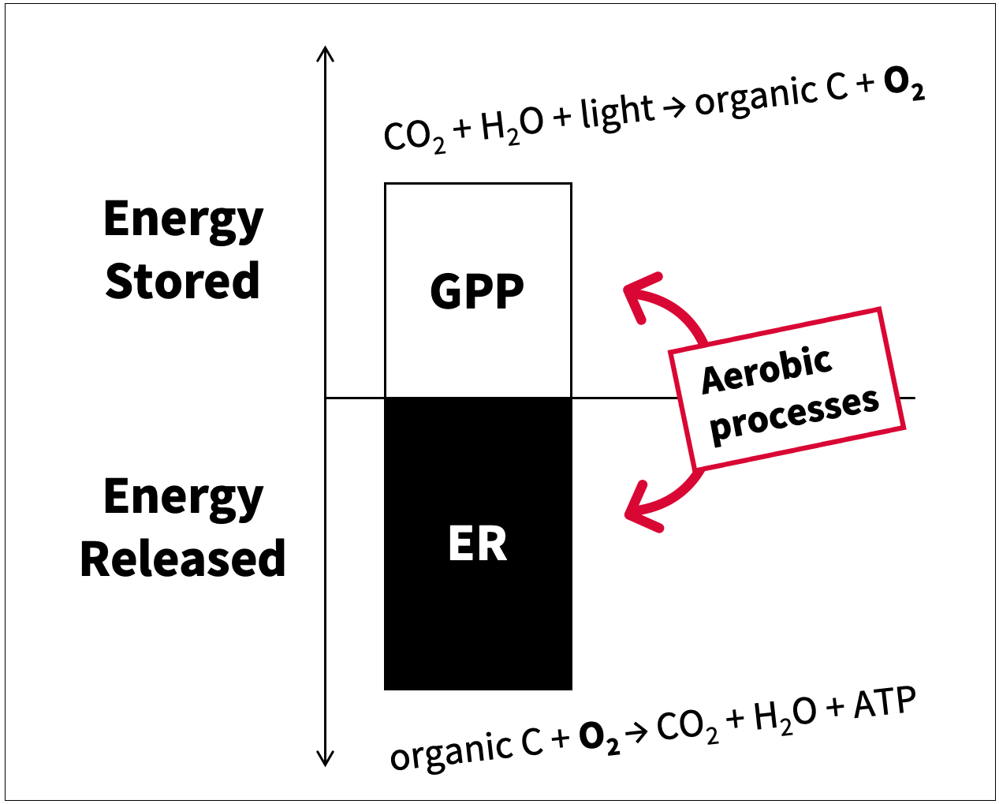
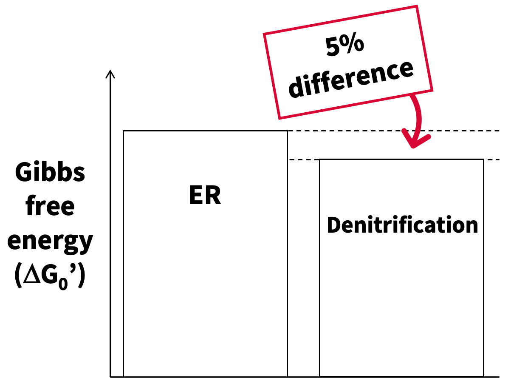

```{r setup, echo = FALSE, message = FALSE, warning = FALSE}
# Load libraries
library(tidyverse)
library(lubridate)
library(plotrix)
library(gridExtra)
library(ggmap)
library(ggrepel)
library(wesanderson)
library(maps)
library(wesanderson)
library(corrplot)
library(svMisc)
library(ggfortify)
library(AppliedPredictiveModeling)
library(caret)
library(knitr)
library(kableExtra)
options(digits=3) # Change rounding to 3 digits

# Colorblind-friendly palette developed by IBM, 2, 4 and 5 color version
ibm2 <- c("#648FFF", "#ffb000")
ibm4 <- c("#785EF0", "#DC267F", "#FE6100", "#FFB000")
ibm5 <- c("#648FFF", "#785EF0", "#DC267F", "#FE6100", "#FFB000")
```

# Abstract

While we focus on the aerobic processes of gross primary production (GPP) and ecosystem respiration (ER) to parameterize stream metabolism, we also know that anaerobic, energy-releasing processes are common in streams. Denitrification, which releases just 5% less free energy than aerobic respiration, is one such process. We ask: are anaerobic energy-generation pathways significant contributors to stream energy budgets? We measured denitrification (acetylene block) and aerobic metabolism in 25 study streams in the USA (NEON n=13, StreamPULSE n=12), modeling GPP and ER using a one or two-station inverse Bayesian approach. This dataset was supplemented with denitrification (15-N tracer) and metabolism from LINXII (n=28). Areal denitrification and ER rates were converted to rates of energy release using Gibbs free energy values. Total energy released was calculated as free energy from denitrification plus ER. Linear, nonlinear, and tree-based regression models, where the best fit model was determined by testing set performance, were used to determine which environmental variables were most important to predicting the proportion of the total energy budget released via denitrification. Preliminary results show denitrification contributing to as much as 9.6% of the total energy budget of a single stream. 

# Introduction  

## Stream metabolism = Energy stored - energy released  

```{r slide3, fig.cap="Generally, we conceptualize stream metabolism as the balance between energy storage through gross primary production (GPP) and energy release through ecosystem respiration (ER)."}

```

## What about anaerobic processes?  

```{r slide4a, fig.cap="We know that the denitrification activity is common in freshwater ecosystems. Figure from Mulholland et al. 2008[@mulholland2008], showing denitrification uptake rates (Uden) in reference (Ref), agricultural (Agr), and urban (Urb) streams from the LINX II study compared to denitrification uptake rates in other rivers, lakes, estuaries, and oceans."}
knitr::include_graphics("images/Slide4a.png")
```

```{r slide4b, fig.cap="We also know that denitrification releases just 5% less free energy than aerobic respiration per electron in reaction.[@stumm_aquatic_1996]"}

```

Therefore, we ask: **Are anaerobic processes significant contributors to stream energy budgets?**

```{r energyFunctions, echo = FALSE}
# Denitrification energy calculation
convertDenit <- function(denitData_mgNm2hr){
  denitData_mgNm2hr * 28.4 * 10 / 1000 / 14 / 2
}
# Ecosystem respiration energy calculation
convertER <- function(ERData_gO2m2d){
  ERData_gO2m2d * 29.9 * 4 * (2/32) / 24
}
# Function for calculating standard error
se <- function(x){
  sd(x, na.rm = T)/sqrt(length(na.omit(x)))
}
```

```{r load_LINXII, echo = FALSE, message = FALSE, warning = FALSE}
### Load LINX II and calculate energy production ##############################
# Site information and denitrification rates
LINXII <- 
  read_csv(file = "data/LINXII_Denit_Mulholland2009.csv", na = "NaN") %>% 
  filter(!is.na(DenitrificationRate_m))
LINXII_sites <- LINXII %>% select(State, SiteName, Organization, LandUse, BIOME, 
                                  Latitude, Longitude, DrainageArea_ha)

# Convert denitrification rate per meter to v_fden 
# (see Mulholland 2009 methods)
LINXII$vfden_cms <- (LINXII$Discharge_Ls / LINXII$Width_m) *
  LINXII$DenitrificationRate_m * 0.1
# Convert v_fden to U_den in mg-N m-2 hr-1
## NOTE: MULHOLLAND ET AL 2009 SAYS to use 3.6 as the conversion factor -
## this is incorrect. The conversion factor should be 36 with these units
## This fix gives data that matches Figure 4 from Mulholland 2009 exactly
LINXII$Denit_mgNm2hr <- (LINXII$vfden_cms * LINXII$NO3_ugNL) * 36

#sum(LINXII$Denit_mgNm2hr <= 0, na.rm = T) / length(LINXII$Denit_mgNm2hr)
LINXII$Denit_mgNm2hr[LINXII$Denit_mgNm2hr <= 0] <- NA

# Load metabolism
LINXII_met <- read_csv(file = "data/LINXII_Metab_Bernot2010.csv", na = "NaN")
# Merge
LINXII <- left_join(LINXII %>% select(-Latitude, -Longitude, -DrainageArea_ha,
                                      -vfden_cms),
          LINXII_met %>% select(-Latitude, -Longitude, -DrainageArea_ha))
rm(LINXII_met)

# Run calculation
LINXII$EnergyDenit_kCalm2hr <- convertDenit(LINXII$Denit_mgNm2hr)
LINXII$EnergyER_kCalm2hr <- convertER(LINXII$ER_gO2m2d)
LINXII$EnergyTot_kCalm2hr <- LINXII$EnergyDenit_kCalm2hr + LINXII$EnergyER_kCalm2hr
LINXII$EnergyDenit_percent <- LINXII$EnergyDenit_kCalm2hr / 
  LINXII$EnergyTot_kCalm2hr * 100
LINXII$EnergyER_percent <- LINXII$EnergyER_kCalm2hr / 
  LINXII$EnergyTot_kCalm2hr * 100

### Create numeric dataset for modeling #######################################
LINXII_numeric <- LINXII %>% 
  select(-Organization, -NOTES, -SiteName, -StudyDate_N15, -StudyDate_Metab) %>%
  mutate_if(is.character, as.factor)
# Dummy variables
dummies <- dummyVars( ~., data = LINXII_numeric)
LINXII_numeric <- data.frame(predict(dummies, newdata = LINXII_numeric))
# Add back in locations
LINXII_numeric$Latitude <- LINXII_sites$Latitude
LINXII_numeric$Longitude <- LINXII_sites$Longitude
LINXII_numeric <- LINXII_numeric %>% na.omit()
# Remove near zero variance columns
nzv <- nearZeroVar(LINXII_numeric)
LINXII_numeric <- LINXII_numeric[, -nzv]
rm(nzv)
rm(dummies)
```

```{r load_CAREER, echo = FALSE, message = FALSE, warning = FALSE}
### Load metabolism models for CAREER data ####################################
# Load list of CAREER sites
CAREER_sites <- read.csv(file = "data/CAREER_SiteAttributes.csv")
CAREER_sites$date <- mdy(CAREER_sites$date)
# Create list of file names using site ID information
fileRegEx <- unique(paste0("predictions_",
                          CAREER_sites$StreamPULSE_SiteID,".*rds"))
# Pull paths of matching file names
fileList <- lapply(fileRegEx, 
                   function(x){list.files(path = "data/all_sp_model_objects",
                                          pattern = x, full.names = T)})
fileList <- unlist(fileList)
# Load model results from files
CAREERMetab <- sapply(fileList, readRDS, simplify = F, USE.NAMES = T)

# Flatten list
CAREERMetab <- bind_rows(CAREERMetab, .id = "site")
# Format daily data
CAREERMetab <- 
  CAREERMetab %>%
  rename(GPP_gO2m2d = GPP, GPP.lower_gO2m2d = GPP.lower, 
         GPP.upper_gO2m2d = GPP.upper, ER_gO2m2d = ER, 
         ER.lower_gO2m2d = ER.lower, ER.upper_gO2m2d = ER.upper) %>%
  mutate(site = str_match(site, "predictions_(\\w{2}_\\w+)_")[,2],
         ER_gO2m2d = abs(ER_gO2m2d), ER.lower_gO2m2d = abs(ER.lower_gO2m2d),
         ER.upper_gO2m2d = abs(ER.upper_gO2m2d)) 

### Calculate ER energy  ######################################################
CAREERMetab$EnergyER_kCalm2hr <- convertER(CAREERMetab$ER_gO2m2d)

### Load nutrient process rates data from CAREER study ####################### 
CAREER <- read_csv(file = "data/CAREER_RatesTable.csv")
CAREER$date <- mdy(CAREER$date)
CAREER <- full_join(CAREER, CAREER_sites)
#sum(CAREER$DenitUnamended_Mean_uMolN2Om2hr <= 0, na.rm = T) / length(CAREER$DenitUnamended_Mean_uMolN2Om2hr)
CAREER$DenitUnamended_SD_uMolN2Om2hr[CAREER$DenitUnamended_Mean_uMolN2Om2hr <= 0] <- NA
CAREER$DenitUnamended_Mean_uMolN2Om2hr[CAREER$DenitUnamended_Mean_uMolN2Om2hr <= 0] <- NA

# Group rock cobble and rock flock into rock category
CAREER$Substrate <- recode(CAREER$Substrate, "Rock Flock" = "Rock", 
                             "Rock scrape" = "Rock", "Gravel" = "Rock",
                             "Bedrock scrape" = "Rock", "Pebble" = "Rock",
                             "Clay" = "Sediment", "Algae" = "Macrophyte",
                           "CPOM" = "Macrophyte")
CAREER$Substrate <- factor(CAREER$Substrate, 
                           levels = c("Sediment", "Macrophyte", "Wood", "Rock"))

# Unite with metabolism data
CAREER <- 
  left_join(CAREER, CAREERMetab, 
            by = c("date", "StreamPULSE_SiteID" = "site")) 

### Calculate denitrification energy, energy budgets  #########################
CAREER$DenitUnamended_Mean_mgNm2hr <- 
  CAREER$DenitUnamended_Mean_uMolN2Om2hr * 2 / 10^3 * 14
CAREER$EnergyDenit_kCalm2hr <- 
  convertDenit(CAREER$DenitUnamended_Mean_mgNm2hr)
CAREER$EnergyTot_kCalm2hr <- 
  CAREER$EnergyDenit_kCalm2hr + CAREER$EnergyER_kCalm2hr
CAREER$EnergyDenit_percent <- 
  CAREER$EnergyDenit_kCalm2hr / CAREER$EnergyTot_kCalm2hr * 100
CAREER$EnergyER_percent <- 
  CAREER$EnergyER_kCalm2hr / CAREER$EnergyTot_kCalm2hr * 100

### Create numeric dataframe for modeling #####################################
CAREER_numeric <- CAREER %>% 
  select(-State, -StreamPULSE_SiteID, -date, -SampleYear, -SampleMonth, 
         -msgs.fit, -warnings, -errors, -Organization, -SiteName, -NEON_SiteID, 
         -StreamPULSE_SiteID) %>%
  mutate_if(is.character, as.factor)
# Dummy variables
dummies <- dummyVars( ~., data = CAREER_numeric)
CAREER_numeric <- data.frame(predict(dummies, newdata = CAREER_numeric))
#CAREER_numeric <- CAREER_numeric %>% na.omit()
# Remove near zero variance columns
nzv <- nearZeroVar(CAREER_numeric)
CAREER_numeric <- CAREER_numeric[, -nzv]
rm(nzv)
rm(dummies)
```

```{r plotNEPmonthlymean, eval = F, fig.cap="Time series data of daily NEP (grey lines) and calculated mean NEP for each day of year (colored lines, A), and calculated mean monthly NEP (B) for the period of record. Shaded ribbons (B) represent standard deviation of NEP.", echo = FALSE, message = FALSE, warning = FALSE, fig.height=5.5, fig.width = 8, fig.pos="center"}
# Plot of DOY vs GPP or ER, faceted by site
a <- 
  ggplot(data = NULL) +
  # Facet wrap plots
  facet_wrap(~site, nrow = 3) +
  # Lines for all years of data
  geom_line(data = modelResults_all, aes(x = DOY, y = NEP, linetype = year), color = "darkgrey", alpha = 0.7) +
  # Lines for mean data
  geom_line(data = modelResults_DOY, aes(x = DOY, y = NEP_mean, color = site)) +
  geom_hline(yintercept = 0, linetype = 2) +
  # Axis labels and scales
  ylab(expression("NEP (g"~O[2]~m^2~"d"^{-1}*")")) +
  xlab("Day of year") +
  labs(tag = "A") +
  # Remove legend for site
  guides(color = FALSE, linetype = guide_legend(nrow = 3, title = "Year")) +
  # Theme adjustments
  theme_classic() +
  theme(axis.text = element_text(color = "black"), 
        panel.background = element_rect(color = "black"),
        legend.position = "bottom") +
  # Color scales
  scale_color_brewer(palette = 2, type = "qual")

# Plot of average NEP by month, all sites on one plot
b <- 
  ggplot(data = modelResults_monthly, aes(x = month, group = site)) +
  # Ribbon for visualizing standard error
  geom_ribbon(aes(ymin = NEP_mean-NEP_sd, 
                  ymax = NEP_mean+NEP_sd, fill = site), alpha = 0.1)+
  # Line and points for mean NEP
  geom_line(aes(y = NEP_mean, color = site)) +
  geom_point(aes(y = NEP_mean, color = site), 
             shape = 21, fill = "white", size = 2) +
  # Horizontal line at y = 0
  geom_hline(yintercept = 0, linetype = 2) +
  # Axis labels and scales
  labs(tag = "B", fill = "Site", color = "Site") +
  ylab(expression("NEP (g"~O[2]~m^2~"d"^{-1}*")")) +
  xlab("Day of year") +
  # Theme adjustments
  guides(color = guide_legend(nrow = 3), fill = guide_legend(nrow = 3))+
  theme_classic() +
  theme(axis.text = element_text(color = "black"), 
        panel.background = element_rect(color = "black"), 
        legend.position = "bottom") +
  # Color scales
  scale_color_brewer(palette = 2, type = "qual") +
  scale_fill_brewer(palette = 2, type = "qual")

grid.arrange(a,b, ncol = 2)
```

```{r plotNEPloess, eval = F, fig.cap="Time series data of daily NEP (grey lines) and calculated mean NEP for each day of year (colored lines, A), and annual trends in NEP over the period of record visualized using local polynomial regression fitting (LOESS, B). Shaded ribbons (B) represent 95% confidence interval on LOESS estimate.", echo = FALSE, message = FALSE, warning = FALSE, fig.height=5.5, fig.width = 8, fig.pos="center"}
# Plot of DOY vs GPP or ER, faceted by site
c <- 
  ggplot(data = NULL) +
  # Facet wrap plots
  facet_wrap(~site, nrow = 3) +
  # Lines for all years of data
  geom_line(data = modelResults_all, aes(x = DOY, y = NEP, linetype = year), color = "darkgrey", alpha = 0.7) +
  # Lines for mean data
  geom_line(data = modelResults_DOY, aes(x = DOY, y = NEP_mean, color = site)) +
  
  geom_hline(yintercept = 0, linetype = 2) +
  # Axis labels and scales
  ylab(expression("NEP (g"~O[2]~m^2~"d"^{-1}*")")) +
  xlab("Day of year") +
  labs(tag = "A") +
  # Remove legend for site
  guides(color = FALSE, linetype = guide_legend(nrow = 3, title = "Year")) +
  # Theme adjustments
  theme_classic() +
  theme(axis.text = element_text(color = "black"), 
        panel.background = element_rect(color = "black"),
        legend.position = "bottom") +
  # Color scales
  scale_color_brewer(palette = 2, type = "qual")

# LOESS smooth
d <- 
  ggplot(data = modelResults_all, aes(x = DOY, y = NEP)) +
  stat_smooth(aes(color = site, fill = site), method = "loess") +
  # Horizontal line at y = 0
  geom_hline(yintercept = 0, linetype = 2) +
  # Axis labels and scales
  labs(tag = "B", fill = "Site", color = "Site") +
  ylab(expression("NEP (g"~O[2]~m^2~"d"^{-1}*")")) +
  xlab("Month") +
  # Theme adjustments
  guides(color = guide_legend(nrow = 3), fill = guide_legend(nrow = 3))+
  theme_classic() +
  theme(axis.text = element_text(color = "black"), 
        panel.background = element_rect(color = "black"), 
        legend.position = "bottom") +
  # Color scales
  scale_color_brewer(palette = 2, type = "qual") +
  scale_fill_brewer(palette = 2, type = "qual")

grid.arrange(c,d, ncol = 2)


# Compute PCA of metabolism data
#prcomp(modelResults_all[,c(3,6,12,13)], center = T, scale. = T)


#modelResults_all %>%
 # select(GPP, ER, NEP, DOY)

# Compute Kmediods using pam (Partitioning Around Medoids) from cluster
#collsub_kmediods <- pam(colleges_sub, k = 3)
# For K-mediods results
#fviz_cluster(collsub_kmediods, data = colleges_sub) + 
 # labs(tag = "B", title = "K-mediods clustering") +
#  theme_classic() +
#  theme(legend.position = "none")
```

# Methods  

```{r plotMap, eval = F, fig.cap="Map of StreamPULSE (n = 12) and NEON (n = 13) study sites used in this analysis. Blue = StreamPULSE site, orange = NEON site. (would be neat to have a way to show years of metabolism record for each site on this map)", echo = FALSE, message = FALSE, warning = FALSE, fig.pos="center", fig.height=6, fig.width = 10}
##### Plot CAREER Site Map #####
# Pull state map data
world.map <- map_data("world")
states.map <- map_data("state")

# Plot map
ggplot() +
  # State and country outlines
  geom_polygon(data = world.map, aes(x = long, y = lat, group = group), 
               color = "grey", size = 0.2, fill = NA) +
  geom_polygon(data = states.map, aes(x = long, y = lat, group = group), 
               color = "grey", size = 0.2, fill = NA) +
  geom_polygon(data = subset(world.map, region == "USA"), 
               aes(x = long, y = lat, group = group), 
               color = "black", size = 0.2, fill = NA) +
  # Location markers and labels
  geom_label_repel(data = CAREER_sites, aes(x = Longitude, y = Latitude, 
                                     label = SiteName), 
                   box.padding = 1, size = 4, nudge_x = 0.01, 
                   segment.size = 0.5, segment.color = "black", 
                   label.size = 0.6) +
  geom_point(data = CAREER_sites, aes(x = Longitude, y = Latitude, 
                                      fill = Organization), 
             shape = 21, 
             color = "black", size = 4, stroke = 1) +
  coord_fixed(1.3, xlim = c(-180,-30), ylim = c(10, 75)) +
  # Theme adjustments
  theme_nothing() +
  theme(panel.background = element_rect(color = "black", fill = "white")) +
  scale_fill_manual(values = ibm4) +
  guides(fill = FALSE)
```

```{r plotMapLINXII, fig.cap="Map of Marcarelli Nationwide Survey (n = 7), and LINXII (n = 48) study sites used in this analysis. Yellow = Marcarelli Nationwide site, blue = LINXII site.", echo = FALSE, message = FALSE, warning = FALSE, fig.pos="center", fig.height=6, fig.width = 10}
##### Plot LINXII and CAREER Site Map #####
# Merge sites_LINXII with CAREER_sites that we have modeled metabolism for
# so far
sites <- full_join(CAREER_sites[as.character(CAREER_sites$SiteName) 
                                %in% unique(CAREER %>% 
                                              filter(!is.na(GPP_gO2m2d)) %>% 
                                              pull(SiteName)),],
                   LINXII_sites)
sites <- distinct(sites, SiteName, .keep_all = TRUE)


# Pull state map data
world.map <- map_data("world")
states.map <- map_data("state")

# Plot map
ggplot() +
  # State and country outlines
  geom_polygon(data = world.map, aes(x = long, y = lat, group = group), 
               color = "black", size = 0.2, fill = NA) +
  geom_polygon(data = states.map, aes(x = long, y = lat, group = group), 
               color = "grey", size = 0.2, fill = NA) +
  geom_polygon(data = subset(world.map, region == "USA"), 
               aes(x = long, y = lat, group = group), 
               color = "black", size = 0.2, fill = NA) +
  # Location markers
  geom_point(data = sites, aes(x = Longitude, y = Latitude, 
                                      fill = Organization), 
             shape = 21, size = 7, alpha = 0.6, color = "black") +
  
  coord_fixed(1.3, xlim = c(-125,-60), ylim = c(15, 50)) +
  # Theme adjustments
  theme_nothing() +
  theme(panel.background = element_rect(color = "black", fill = "white")) +
  scale_fill_manual(values = ibm2) +
  scale_color_manual(values = ibm2) +
  guides(fill = FALSE)
```

## Sites and data  

### LINX II project  

Whole-stream **denitrification** rates, measured using **15-N tracer** (as $k_{den}$, $m^{-1}$), were obtained from Mulholland et al. [-@mulholland2009] appendix. Rates were then converted to areal denitrification rates using conversion steps outlined in the methods of Mulholland et al. [-@mulholland2009], where $k_{denT}$ = denitrification rate per unit time ($d^{-1}$), $v$ = average water velocity ($cm ~ s^{-1}$), $v_{fden}$ = denitrification uptake velocity ($cm ~ s^{-1}$), $Q$ = discharge ($L ~ s^{-1}$), $w$ = average stream wetted width ($m$),$U_{den}$ = areal denitirification rate ($mg ~ m^{-2} ~ hr^{-1}$), $C$ = ambient nitrate concentration (ug-N $L^{-1}$).

$$
k_{denT} = k_{den} \times v \times 864
$$

$$
v_{fden} = \frac{Q}{w} \times k_{den} \times 0.1
$$

$$
U_{den} = v_{fden} \times C \times 36
$$

Modeled **metabolism** (gross primary production, ecosystem respiration) for streams in the LINX II project was obtained from Bernot et al. [-@bernot2010] supplemental information.  

### Marcarelli nationwide denitrification and N fixation survey  

Denitrification was measured on individual stream substrates using **acetylene inhibition** assays.  

Modeled **metabolism** obtained from StreamPULSE repository, https://data.streamPULSE.org.  

## Energy budget calculation  

Process rates (ex. denitrification in mg-N $m^{-2} ~ hr^{-1}$) were converted to energy production rates (kCal $m^{-2} ~ hr^{-1}$) using Gibbs free energy ($\Delta G$) values and molar conversion factors from the balanced chemical reactions of each process [@stumm_aquatic_1996].  

### Aerobic respiration  

$$
Energy~released~from~ER = ER~rate \times \Delta G_{0}'\times e^{-}~in~balanced~reaction
$$

Where ER rate is in $g~O_{2}~m^{-2}~d^{-1}$, and Gibbs free energy or $\Delta G_{0}'$ is in $kCal~e^{-1}$. Applying unit conversions, where there are 32 $g~O_{2}~mol~O_{2}^{-1}$, 2 mol O per mol $O_{2}$, 1 mol $O_{2}$ per balanced reaction, and 24 hours per day, this becomes energy released from ER in kCal $m^{-2} ~ hr^{-1}$:

$$
Energy~released~from~ER = ER~rate \times 29.9 \times 4 \div 32 \times 2 \div 24
$$

### Denitrification

$$
Energy~released~from~denitrification = Denitrification~rate \times \Delta G_{0}' \times e^{-}~in~balanced~reaction
$$

Where denitrification rate is in $mg~N~m^{-2}~hr^{-1}$, and $\Delta G_{0}'$ is in $kCal~e^{-1}$. Applying unit conversions, where there are 1000 mg per g, 14 $g~N~mol{-1}$, and 2 mol N per balanced reaction, this becomes energy released from denitrification in kCal $m^{-2} ~ hr^{-1}$:

$$
Energy~released~from~denitrification = Denitrification~rate \times 28.4 \times 10 \div 1000 \div 14 \div 2
$$

## Predictive modeling approach  

### Pre-processing  

- **Dummy variables** for categorical predictors  
- Removed **near zero variance** predictors, cutoff ratio = 95/5  
- **Centered, scaled**  

### Splitting and resampling  

- Data **randomly split** into training and testing sets, **80% training** and **20% testing**  
- **10-fold cross-validation** for resampling, repeated **10 times**

### Evaluating model performance  

- Best fit model determined by the **lowest** root mean squared error (**RMSE**) on testing set  

### Pre-processed LINX II dataset  

- **28 observations, 28 predictors**  
  - 8 categorical (ex. state, land use, biome)  
  - 20 continuous (ex. discharge, reach width, DOC, NO3, SRP, GPP, ER)  
- **Response:** Energy released from denitrification as a proportion of total energy (%)  

# Results and discussion

## Denitrification as a proportion of total energy

**Streams with low denitrification rates could still depend on energy generated by denitrification.**

```{r LINXIIDenitRatevsPercentTotalNRG, fig.cap="LINX II streams with 'low' denitrification rate may still source a significant portion of their energy from denitrification, when total energy is considered as Gibbs free energy produced through denitrification plus Gibbs free energy produced through ecosystem respiration. Dashed line has a slope of 1, representing a denitrification rate proportional to the fraction of total energy released from denitrification. Blue points represent sites where the energy contribution from denitrification is greater than expected, red points represent sites where the energy contribution from denitrification is less than expected.", fig.height=6, fig.width=6, fig.pos="H"}
ggplot(data = LINXII, aes(x = Denit_mgNm2hr, y = EnergyDenit_percent)) +
  geom_abline(slope = 1, intercept = 0, linetype = 2) +
  # Label with site names
  #geom_text_repel(label = LINXII$SiteName, size = 3) + 
  # Add data points
  geom_point(size = 5, shape = 21) +
  # Add colored data points
  geom_point(data = subset(LINXII, EnergyDenit_percent > Denit_mgNm2hr),
             fill = "#638DFF", size = 5, shape = 21) +
  geom_point(data = subset(LINXII, EnergyDenit_percent < Denit_mgNm2hr),
             fill = "#D90734", size = 5, shape = 21) +
  coord_cartesian(xlim = c(0, 10)) +
  # Theme adjustments
  theme_classic() +
  labs(x = expression("Denitrification rate (mg-N" ~ m^{-2} ~ hr^{-1} * ")"), 
       y = expression("Energy released from denitrification as a proportion of total energy budget (%)")) +
  theme(panel.border = element_rect(color = "black", fill = NA),
        axis.text = element_text(color = "black"),
        legend.position = c(0.2, 0.8),
        legend.background = element_rect(color = "black", fill = NA))

# Quartiles
#quantile(LINXII$EnergyDenit_percent, na.rm = T)
#quantile(CAREER$EnergyDenit_percent, na.rm = T)
```

## Predictive modeling

**[Nitrate] important factor in controlling energy production from denitrification.**

```{r LINXIIPredictiveModel, cache = T, warning=F, message=F, echo=F, results='hide'}
#### LINX II Predictive Model ####
# Predictive model to determine importance of predictors for the denitrification
# proportion of energy budget 
dataFrameName <- LINXII_numeric %>% select (-EnergyER_percent,
                                            -Denit_mgNm2hr,-EnergyDenit_kCalm2hr) 
# Remove percent of total energy  budget from ER as this will be directly 
# correlated with % of total from denitrification, remove denitrification rate 

# Pre-process data
preproc <- preProcess(dataFrameName, method = c("center", "scale", 
                                                "knnImpute", "nzv"),
                      k = 5, freqCut = 95/5)
transfor <- predict(preproc, newdata = dataFrameName)
# Split the data into predictors and response 
response <- transfor$EnergyDenit_percent
predictors <- transfor %>% select(-EnergyDenit_percent)

# Check for highly correlated predictors and remove highly correlated 
# predictors using a cutoff value of 85%
highCorr <-findCorrelation(cor(predictors), cutoff = 0.85)
message("Omitted highly correlated predictors above cutoff value of 0.85: ", paste(names(predictors[highCorr]), collapse = ", "))
predictors <- predictors[-highCorr]

# 28 observations, 28 variables, n = p

# Split data into training and testing
set.seed(999)
trainIndex <- createDataPartition(dataFrameName$EnergyDenit_percent, 
                                  p = .80, list = FALSE)
predictors_train <- predictors[trainIndex,]
predictors_test <- predictors[-trainIndex,]
response_train <- response[trainIndex]
response_test <- response[-trainIndex]

# Set up a 10 fold repeated CV for all models
fitControl <- trainControl(method = "repeatedcv", number = 10,
                           ## repeated 3 times for testing
                           repeats = 10)

# Linear regression: partial least squares, elastic net
# Nonlinear regression: neural net, mars, svm, knn
# Regression trees: single regression trees

## pls model
set.seed(999)
plsModel <- train(x = predictors_train, y = response_train, method = "pls", 
                   trControl = fitControl, tuneLength = 20)
#plot(plsModel)
plsPred <- predict(plsModel, newdata = predictors_test)
plsResults <- postResample(pred = plsPred, obs = response_test)

## Elastic net
enetGrid <- expand.grid(.lambda = c(0.001, 0.1, 0.5), 
                        .fraction = seq(0.05, 1, length = 20))
set.seed(999)
enetTune <- train(x = predictors_train, y = response_train, method = "enet", 
                  tuneGrid = enetGrid, trControl = fitControl)
#plot(enetTune, main = "Elastic Net Regression")
# Evaluate test set performance
enetPredic <- predict(enetTune, predictors_test)
enetResults <- postResample(pred = enetPredic, obs = response_test)

## neural network
nnetGrid <- expand.grid(.decay = c(0, 0.01), .size = c(1:20),.bag = FALSE)
set.seed(999)
nnetModel <- train(x = predictors_train, y = response_train, method = "avNNet", 
                   tuneGrid = nnetGrid,
                   trControl = fitControl)
#plot(nnetModel, main = "neural net")
# Evaluate test set performance
nnetPred <- predict(nnetModel, newdata = predictors_test)
nnetResults <- postResample(pred = nnetPred, obs = response_test)

## MARS
set.seed(999)
marsModel <- train(x = predictors_train, y = response_train, method = "earth", 
                   tuneGrid = expand.grid(.degree = 1:2, .nprune = 2:30),
                   trControl = fitControl)
#plot(marsModel, main = "MARS")
# Evaluate test set performance
marsPred <- predict(marsModel, newdata = predictors_test)
marsResults <- postResample(pred = marsPred, obs = response_test)

## SVM
library(kernlab)
# Choosing to evaluate a radial SVM
set.seed(999)
svmRTuned <- train(x = predictors_train, y = response_train, method = "svmRadial",
                   tuneLength = 9, trControl = fitControl)
#plot(svmRTuned, main = "Radial SVM")
# Evaluate test set performance
svmRPred <- predict(svmRTuned, newdata = predictors_test)
svmRResults <- postResample(pred = svmRPred, obs = response_test)

## KNN
set.seed(999)
knnTune <- train(x = predictors_train, y = response_train, method = "knn", 
                 tuneGrid = data.frame(.k = 1:10), trControl = fitControl)
#plot(knnTune, main = "KNN")
# Evaluate test set performance
knnPred <- predict(knnTune, newdata = predictors_test)
knnResults <- postResample(pred = knnPred, obs = response_test)

## random forest
library(randomForest)
set.seed(999)
forestTune <- train(x = predictors_train, y = response_train, 
                        method = "cforest", 
                        trControl = fitControl)
#plot(forestTune)
# Evaluate test set performance
forestPred <- predict(forestTune, newdata = predictors_test)
forestResults <- postResample(pred = forestPred, obs = response_test)

## boosted trees
gbmGrid <- expand.grid(interaction.depth = seq(1, 7, by = 2), 
                       n.trees = seq(10, 200, by = 50), 
                       shrinkage = c(0.01, 0.1), n.minobsinnode = 2)
boostTune <- train(x = predictors_train, y = response_train, 
                        method = "gbm", tuneGrid = gbmGrid, verbose = F,
                        trControl = fitControl)
#plot(boostTune)
boostPred <- predict(boostTune, newdata = predictors_test)
boostResults <- postResample(pred = boostPred, obs = response_test)

# Display fit results
LINXIIRMSE <- data.frame(plsResults, enetResults, nnetResults, marsResults, 
                         svmRResults, knnResults, forestResults, boostResults)
```

```{r RMSEtable}
# Display table
LINXIIRMSE %>%
  rename(PLS = plsResults, "Elastic net" = enetResults, 
         "Neural net" = nnetResults, MARS = marsResults, 
         "Radial SVM" = svmRResults, KNN = knnResults, 
         "Random forest" = forestResults, "Boosted trees" = boostResults) %>%
  kable(caption = "Summary of model performance on testing set.", 
        booktabs = T) %>%
  column_spec(5, bold = T)
```

```{r variableImportancePlot, fig.height=4, fig.width=4, fig.pos="H", fig.cap = "Most important predictors for best fit model (MARS) predicting denitrification proportion of energy budget (%) in LINX II streams."}
# Explore predictor importance from best fit model (lowest RMSE)
plot(varImp(marsModel), 2, col = "black")
```

## Breakdown by substrate

**Substrate with highest rates of denitrification may be contributing the least amount to total energy budget.**

```{r CAREERDenitRatevsPercentTotalNRG, fig.cap="Substrates with the highest rates of denitrification may be contributing the least amount to the total energy budget. Dashed line has a slope of 1, representing a denitrification rate proportional to the fraction of total energy released from denitrification. Data is from a subset of 7 streams from the Marcarelli Nationwide Survey (total n = 21).", fig.height=6, fig.width=6, fig.pos="H"}
ggplot(data = subset(CAREER, !is.na(DenitUnamended_Mean_mgNm2hr)), 
       aes(x = DenitUnamended_Mean_mgNm2hr, y = EnergyDenit_percent, 
           fill = Substrate)) +
  geom_abline(slope = 1, intercept = 0, linetype = 2) +
  # Add data points
  geom_point(size = 5, aes(shape = Substrate)) +
  coord_cartesian(xlim = c(0, 10)) +
  # Theme adjustments
  theme_classic() +
  labs(x = expression("Denitrification rate (mg-N" ~ m^{-2} ~ hr^{-1} * ")"), 
       y = expression("Energy released from denitrification as a proportion of total energy budget (%)")) +
  scale_fill_manual(values = ibm4) +
  scale_shape_manual(values = c(21, 22, 23, 24)) +
  theme(panel.border = element_rect(color = "black", fill = NA),
        axis.text = element_text(color = "black"),
        legend.position = c(0.8, 0.15),
        legend.background = element_rect(color = "black", fill = NA))
```

```{r plotCAREERRates, fig.cap="Unamended denitrification rates (n = 71) measured on multiple substrates (macrophyte, rock, sediment, wood) present at each study site as part of the Marcarelli Nationwide Survey. Boxplot error bars extend from the first quartile minus 1.5 times the interquartile range to the third quartile plus 1.5 times the interquartile range, middle bar denotes median.", echo = FALSE, message = FALSE, warning = FALSE, fig.height=6, fig.width = 6, fig.pos="center"}
#CAREER %>% group_by(Substrate) %>% summarise(median(DenitUnamended_Mean_mgNm2hr, na.rm = T))

# Boxplot of denitrification rates, by substrate
ggplot(data = subset(CAREER, !is.na(DenitUnamended_Mean_mgNm2hr)),
       aes(y = DenitUnamended_Mean_mgNm2hr, x = Substrate)) +
  stat_boxplot(geom = "errorbar", width = 0.2) +
  geom_boxplot(aes(fill = factor(Substrate)), outlier.shape = NA, width = 0.7) +
  geom_jitter(color = "black", size = 2, width = 0.2, shape = 21, fill = "white") +
  # Axis labels and scales
  xlab(expression("Substrate type")) +
  ylab(expression("Denitrification rate (mg-N"~m^2~"hr"^{-1}*")")) +
  scale_fill_manual(values = ibm4) +
  scale_x_discrete(limits = c("Sediment", "Macrophyte", "Wood", "Rock")) +
  theme_classic() +
  theme(axis.text = element_text(color = "black"), 
        axis.text.y = element_text(size = 8),
        panel.background = element_rect(color = "black"), 
        legend.position = "none") 
```

# Further directions  

- Remaining **metabolism modeling** for Marcarelli Nationwide Survey (n = 24 sites, including 14 NEON Network sites)  

- **Scaling** Marcarelli Nationwide chamber rates to **whole-stream** estimates at NEON sites, using **NEON stream morphology data products**  

- **Exploring** factors that impact the **energy production from denitrification** in each **substrate**  

```{r plotMapAll, fig.cap="Map of sites used in this current analysis (in grey; Marcarelli Nationwide Survey n = 7, LINX II n = 48) and sites where raw data is available but metabolism has not yet been modeled (in red; Marcarelli Nationwide Survey n = 24).", echo = FALSE, message = FALSE, warning = FALSE, fig.pos="center", fig.height=6, fig.width = 10}
#Grab data from sites where metabolism not yet modeled
unmodeledSites <- CAREER_sites[as.character(CAREER_sites$SiteName) %in% 
                                 unique(CAREER %>% 
                                          filter(is.na(GPP_gO2m2d)) %>% 
                                          pull(SiteName)),]
unmodeledSites <- distinct(CAREER_sites, SiteName, .keep_all = TRUE)

# Plot map
ggplot() +
  # State and country outlines
  geom_polygon(data = world.map, aes(x = long, y = lat, group = group), 
               color = "black", size = 0.2, fill = NA) +
  geom_polygon(data = states.map, aes(x = long, y = lat, group = group), 
               color = "grey", size = 0.2, fill = NA) +
  geom_polygon(data = subset(world.map, region == "USA"), 
               aes(x = long, y = lat, group = group), 
               color = "black", size = 0.2, fill = NA) +
  # Location markers
  geom_point(data = sites, aes(x = Longitude, y = Latitude), 
             shape = 21, size = 7, alpha = 0.6, color = "black", fill = "lightgrey") +
  geom_point(data = unmodeledSites, aes(x = Longitude, y = Latitude), 
             shape = 21, size = 7, alpha = 0.6, color = "black", fill = "#D90734") +
  coord_fixed(1.3, xlim = c(-125,-60), ylim = c(15, 50)) +
  # Theme adjustments
  theme_nothing() +
  theme(panel.background = element_rect(color = "black", fill = "white")) +
  guides(fill = FALSE)
```


```{r CAREERPredictiveModel,eval=F}
dataFrameName <- subset(CAREER_numeric, !is.na(EnergyTot_kCalm2hr)) %>% 
  select (-EnergyER_percent,-DenitUnamended_Mean_mgNm2hr,
          -DenitUnamended_Mean_uMolN2Om2hr,-EnergyDenit_kCalm2hr) 

# Pre-process data
preproc <- preProcess(dataFrameName, method = c("center", "scale", 
                                                "knnImpute", "nzv"),
                      k = 5, freqCut = 95/5)
transfor <- predict(preproc, newdata = dataFrameName)
# Split the data into predictors and response 
response <- transfor$EnergyDenit_percent
predictors <- transfor %>% select(-EnergyDenit_percent)

# Check for highly correlated predictors and remove highly correlated 
# predictors using a cutoff value of 85%
highCorr <-findCorrelation(cor(predictors), cutoff = 0.85)
message("Omitted highly correlated predictors above cutoff value of 0.85: ", paste(names(predictors[highCorr]), collapse = ", "))
predictors <- predictors[-highCorr]

# 17 observations, 24 variables, n < p

# Split data into training and testing using 10 fold cross validation
set.seed(999)
trainIndex <- createFolds(dataFrameName$EnergyDenit_percent, 
                               k = 10, list = FALSE)
predictors_train <- predictors[trainIndex,]
predictors_test <- predictors[-trainIndex,]
response_train <- response[trainIndex]
response_test <- response[-trainIndex]

# Set up a 10 fold repeated CV for all models
fitControl <- trainControl(method = "repeatedcv", number = 10, repeats = 10)

# Train MARS, SVM, KNN, and elastic net models
## MARS
set.seed(999)
marsModel <- train(x = predictors_train, y = response_train, method = "earth", 
                   tuneGrid = expand.grid(.degree = 1:2, .nprune = 2:15),
                   trControl = fitControl)
plot(marsModel, main = "MARS")
# Evaluate test set performance
marsPred <- predict(marsModel, newdata = predictors_test)
marsResults <- postResample(pred = marsPred, obs = response_test)

## SVM
library(kernlab)
# Choosing to evaluate a radial SVM
set.seed(999)
svmRTuned <- train(x = predictors_train, y = response_train, method = "svmRadial",
                   tuneLength = 7, trControl = fitControl)
plot(svmRTuned, main = "Radial SVM")
# Evaluate test set performance
svmRPred <- predict(svmRTuned, newdata = predictors_test)
svmRResults <- postResample(pred = svmRPred, obs = response_test)

## KNN
set.seed(999)
knnTune <- train(x = predictors_train, y = response_train, method = "knn", 
                 tuneGrid = data.frame(.k = 1:30), trControl = fitControl)
plot(knnTune, main = "KNN")
# Evaluate test set performance
knnPred <- predict(knnTune, newdata = predictors_test)
knnResults <- postResample(pred = knnPred, obs = response_test)

## Elastic net
enetGrid <- expand.grid(.lambda = c(1E-6, 0.00001, 0.0001, 0.001, 0.1, 0.5, 1), 
                        .fraction = seq(0.05, 1, length = 20))
set.seed(999)
enetTune <- train(x = predictors_train, y = response_train, method = "enet", 
                  tuneGrid = enetGrid, trControl = fitControl)
plot(enetTune, main = "Elastic Net Regression")
# Evaluate test set performance
enetPredic <- predict(enetTune, predictors_test)
enetResults <- postResample(pred = enetPredic, obs = response_test)

# Display fit results
data.frame(marsResults, svmRResults, knnResults, enetResults)

#defaultSummary(data.frame(obs = testResponse, pred = enetPredic))
# f. which predictors are most important?
plot(varImp(enetTune), 5, 
     main = "Importance of Predictors according to Linear Elastic Net")

# Explore predictor importance from best fit model (lowest RMSE)
plot(varImp(marsModel), 5, 
     main = "Importance of Predictors")

plot(marsModel$finalModel)
```

```{r PCA, fig.cap="Plots showing the first two principle components from PCA analysis of the assembled LINX II dataset. Plot A shows the first two principle components with points labeled with site names. Plot B shows the first two principle components with labeled eigenvectors overlaid.", fig.height=8, fig.width=5, fig.pos="H", eval = F}
# Compute PCA, center and scale the data
pcaModel <- prcomp(predictors, center = TRUE, scale. = TRUE) 
# Predict on data
LINXII_PCA <- predict(pcaModel, predictors)

# Plot first 2 PCA scores in ggplot using ggfortify
a <- 
  autoplot(pcaModel, size = 2) +
  # Label each point with the site
  #geom_text_repel(label = na.omit(LINXII)$State, size = 2.5) + 
  # Adjust theme
  theme_classic() +
  labs(tag = "A") +
  theme(axis.text = element_text(color = "black"),
        panel.background = element_rect(color = "black"))

b <- 
  autoplot(pcaModel, size = 2, colour = "grey",
           # Add eigenvectors
           loadings = TRUE, loadings.label = TRUE, loadings.label.size = 3,
           loadings.label.repel = TRUE, loadings.label.colour = "black") +
  # Label each point with the site
  #geom_text_repel(label = na.omit(LINXII)$SiteName, color = "grey") + 
  # Adjust theme
  theme_classic() +
  labs(tag = "B") +
  theme(axis.text = element_text(color = "black"),
  panel.background = element_rect(color = "black"))

grid.arrange(a, b, nrow = 2)
```

# Supplemental images

![Table 8.7. from Stumm and Morgan 1996, page 474.[@stumm_aquatic_1996 pp. 474].](images/Table8-7.jpeg)

![Figure 8.14. from Stumm and Morgan 1996, page 477.[@stumm_aquatic_1996 pp. 477].](images/Figure8-14.jpeg){height=75%}

## Acknowledgments {.appendix}

**Marcarelli Nationwide Denitrification and N2 Fixation Survey:** We thank C. Allison, A. Copley, J. Cornell, E. Coscarelli, A. Eckersell, H. Harris, D. Larson, J. Ortiz, J. Paris, H. Roose, R. Schipper, and R. Van Goethem for field and laboratory assistance. This research was funded by the National Science Foundation Grant DEB 14-51919 to Amy M. Marcarelli.

**Lotic Intersite Nitrogen eXperiment II (LINX-II):** Funding for the Lotic Intersite Nitrogen eXperiment II (LINX-II) project was provided by the National Science Foundation Division of Environmental Biology (NSF Grant DEB-0111410). Raw data collected by LINX-II is available from the Environmental Data Initiative repository here: https://doi.org/10.6073/pasta/eac34b6c1cfb0268dd76ef68a7a90bfc. Whole-stream denitrification rates measured using 15-N tracers are from from Mulholland et al. 2009 Supplemental, https://www.doi.org/10.4319/lo.2009.54.3.0666. Modeled metabolism data obtained from Bernot et al. 2010 Supplemental, https://www.doi.org/10.1111/j.1365-2427.2010.02422.x.

**StreamPULSE Network:** Additional data sets were provided by the StreamPULSE Network, with funding provided by the National Science Foundation Macrosystems program (NSF Grant EF 14-42439). https://data.streamPULSE.org 

**National Ecological Observatory Network (NEON):** We especially thank Kaelin Cawley, Keli Goodman, and Bobby Hensley for their assistance with metabolism modeling efforts. The National Ecological Observatory Network is a program sponsored by the National Science Foundation and operated under cooperative agreement by Battelle Memorial Institute. This material is based in part upon work supported by the National Science Foundation through the NEON Program. 
